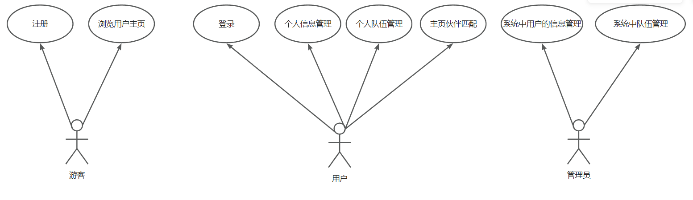

# 伙伴匹配后端

[项目笔记](https://www.yuque.com/guangjun-0q7tw/sy4yod/br9vz8rb4xhttlop)

[演示视频](https://www.bilibili.com/video/BV1Bm421W7YE/)

# 项目介绍
基于 SpringBoot + Vue3 的移动端网站，实现用户信息管理，搜索标签，队伍管理，匹配伙伴，组队等功能。

# 项目模块
1. 注册登录模块

   a. 功能：注册、登录

2. 用户信息模块
 
   a. 首页用户信息展示

   b.根据标签搜索用户

   c.用户个人信息管理(包括标签管理)

   d. 功能：伙伴匹配

3. 队伍模块

   a. 队伍管理(新增队伍，解散队伍，更新队伍，查询队伍，退出队伍)


# 业务逻辑
用户通过注册，登录到主页面，用户有着个人信息的管理，可以通过修改标签，搜索标签，匹配伙伴等找到相应的伙伴，其次有着组队功能，用户可以创建组队，包括公开，私有，加密队伍。更新队伍，解散队伍，加入队伍等队伍管理功能。

# 用例图



# 数据库设计

```sql
create database friend;


use friend;

-- auto-generated definition
create table user
(
id           bigint auto_increment comment 'id'  primary key,
username     varchar(256)                       null comment '用户昵称',
userAccount  varchar(256)                       null comment '账号',
userPassword varchar(512)                       not null comment '密码'
userStatus   int      default 0                 not null comment '状态 0 - 正常',
avatarUrl    varchar(1024)                      null comment '用户头像',
gender       tinyint                            null comment '性别',
profile      varchar(512)                       null comment '个人简历',
phone        varchar(128)                       null comment '电话',
email        varchar(512)                       null comment '邮箱',
userRole     int      default 0                 not null comment '用户角色 0 - 普通用户 1 - 管理员',
tags         varchar(1024)                      null comment '标签 json 列表',
createTime   datetime default CURRENT_TIMESTAMP null comment '创建时间',
updateTime   datetime default CURRENT_TIMESTAMP null on update CURRENT_TIMESTAMP,
isDelete     tinyint  default 0                 not null comment '是否删除',
)
comment '用户';


-- auto-generated definition
create table team
(
id          bigint auto_increment comment 'id'		primary key,
name        varchar(256)                       not null comment '队伍名称',
description varchar(1024)                      null comment '描述',
maxNum      int      default 1                 not null comment '最大人数',
expireTime  datetime                           null comment '过期时间',
userId      bigint                             null comment '用户id（队长 id）',
status      int      default 0                 not null comment '0 - 公开，1 - 私有，2 - 加密',
password    varchar(512)                       null comment '密码',
hasJoinNum  int                                null comment '队伍加入人数',
teamUrl     varchar(1024)                      null comment '队伍头像'
createTime  datetime default CURRENT_TIMESTAMP null comment '创建时间',
updateTime  datetime default CURRENT_TIMESTAMP null on update CURRENT_TIMESTAMP,
isDelete    tinyint  default 0                 not null comment '是否删除',
)
comment '队伍';


-- auto-generated definition
create table user_team
(
id         bigint auto_increment comment 'id' primary key,
userId     bigint                             null comment '用户id',
teamId     bigint                             null comment '队伍id',
joinTime   datetime                           null comment '加入时间',
createTime datetime default CURRENT_TIMESTAMP null comment '创建时间',
updateTime datetime default CURRENT_TIMESTAMP null on update CURRENT_TIMESTAMP,
isDelete   tinyint  default 0                 not null comment '是否删除'
)
comment '用户队伍关系';
```
